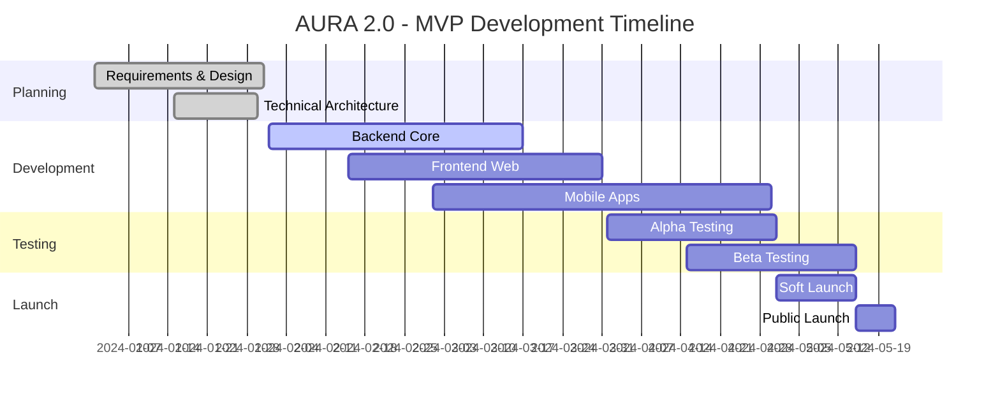

# MVP ROADMAP - AURA 2.0
## Planejamento Detalhado para o Minimum Viable Product

## 📅 TIMELINE GERAL



## 🎯 MVP SCOPE

### Features Incluídas no MVP

#### ✅ MODOS (3 de 5)
1. **FLASH** - Grid view para conexões rápidas
2. **ALMA** - Swipe tradicional com algoritmo
3. **VIBE** - Comunidade básica

#### ✅ CORE FEATURES
- Registro/Login (Email + Social)
- Perfil completo com fotos
- Verificação básica (Email + Foto)
- Match & Chat básico
- Notificações push
- Segurança essencial
- Plano FREE + ESSENTIAL

### Features para V2
- **AURA Premium** (modo exclusivo)
- **RADAR** (proximidade)
- Vídeo chat
- Verificação avançada
- Gamificação completa
- Eventos presenciais
- Planos PREMIUM e ELITE

## 📊 SPRINT BREAKDOWN

### SPRINT 0: Setup & Planning (2 semanas)
```yaml
Objective: Preparar ambiente e infraestrutura

Tasks:
  Backend:
    - [ ] Setup repositório e CI/CD
    - [ ] Configurar Docker environment
    - [ ] Setup PostgreSQL + Redis
    - [ ] Configurar NestJS boilerplate
    - [ ] Setup monitoring (Sentry/New Relic)
  
  Frontend:
    - [ ] Setup Next.js projeto
    - [ ] Configurar Tailwind + Radix UI
    - [ ] Setup Storybook
    - [ ] Configurar testes
  
  Mobile:
    - [ ] Setup projetos iOS/Android
    - [ ] Configurar build pipelines
    - [ ] Setup code signing
  
  DevOps:
    - [ ] Setup AWS/Azure accounts
    - [ ] Configurar Terraform básico
    - [ ] Setup GitHub Actions
    - [ ] Configurar ambientes (dev/staging/prod)

Deliverables:
  - Ambiente de desenvolvimento funcional
  - Pipeline CI/CD básico
  - Documentação de setup
```

### SPRINT 1-2: Authentication & User Management (2 semanas)
```yaml
Objective: Sistema completo de autenticação

Epics:
  AUTH-001: Registration Flow
    - Email/password registro
    - Social login (Google/Apple/Facebook)
    - Email verification
    - Phone verification (SMS)
  
  AUTH-002: Login & Session
    - JWT implementation
    - Refresh tokens
    - Remember me
    - Password reset
  
  AUTH-003: User Profile
    - Profile CRUD
    - Photo upload (max 9)
    - Interests selection
    - Preferences settings

API Endpoints:
  - POST /auth/register
  - POST /auth/login
  - POST /auth/logout
  - POST /auth/refresh
  - POST /auth/verify-email
  - POST /auth/verify-phone
  - GET/PATCH /users/me
  - POST /users/me/photos

Acceptance Criteria:
  - User can register with email
  - User can login with social
  - User receives verification emails
  - User can upload photos
  - Session persists correctly
```

### SPRINT 3-4: FLASH Mode Implementation (2 semanas)
```yaml
Objective: Grid view completo e funcional

Epics:
  FLASH-001: Grid Display
    - 3x3 grid layout
    - Pagination
    - Real-time online status
    - Distance display
  
  FLASH-002: Filtering
    - Age range filter
    - Distance filter
    - Online only filter
    - Verified only filter
  
  FLASH-003: Quick Actions
    - Tap to view profile
    - Double tap to like
    - Long press for quick chat
    - Block/Report

API Endpoints:
  - GET /modes/flash/grid
  - POST /actions/like
  - POST /actions/pass
  - POST /chat/quick-message

Acceptance Criteria:
  - Grid loads in < 2 seconds
  - Filters work correctly
  - Online status updates real-time
  - Quick actions are responsive
```

### SPRINT 5-6: ALMA Mode Implementation (2 semanas)
```yaml
Objective: Swipe experience com algoritmo

Epics:
  ALMA-001: Swipe Interface
    - Card stack display
    - Swipe gestures
    - Undo last action
    - Card animations
  
  ALMA-002: Algorithm v1
    - Basic compatibility scoring
    - Interest matching
    - Activity-based ranking
    - Daily queue generation
  
  ALMA-003: Super Likes
    - Super like animation
    - Daily limits (FREE: 1, ESSENTIAL: 5)
    - Priority notification

API Endpoints:
  - GET /modes/alma/queue
  - POST /actions/swipe
  - POST /actions/super-like
  - POST /actions/undo

ML Models:
  - Basic collaborative filtering
  - Interest similarity matrix
  - Activity scoring

Acceptance Criteria:
  - Smooth swipe experience
  - Queue refreshes daily
  - Algorithm improves with usage
  - Super likes work correctly
```

### SPRINT 7-8: Matching & Chat System (2 semanas)
```yaml
Objective: Sistema de matches e mensagens

Epics:
  MATCH-001: Match Creation
    - Mutual like detection
    - Match celebration animation
    - Match notifications
    - Icebreaker suggestions
  
  CHAT-001: Messaging
    - Text messages
    - Photo sharing
    - Read receipts
    - Typing indicators
  
  CHAT-002: Real-time
    - WebSocket implementation
    - Message delivery
    - Online presence
    - Push notifications

API Endpoints:
  - GET /matches
  - DELETE /matches/:id
  - GET /conversations/:id/messages
  - POST /conversations/:id/messages
  - WebSocket /ws/chat

Acceptance Criteria:
  - Matches create instantly
  - Messages deliver in < 1 second
  - Typing indicators work
  - Push notifications work
  - Chat history persists
```

### SPRINT 9-10: VIBE Mode Basic (2 semanas)
```yaml
Objective: Comunidade e grupos básicos

Epics:
  VIBE-001: Groups
    - Browse groups
    - Join/Leave groups
    - Group chat
    - Create group (premium)
  
  VIBE-002: Friend Matching
    - Different algorithm
    - Friend profiles
    - Activity suggestions
    - Mutual friends

API Endpoints:
  - GET /modes/vibe/groups
  - POST /groups/:id/join
  - GET /modes/vibe/friends
  - POST /friends/connect

Acceptance Criteria:
  - Users can browse groups
  - Group chat works
  - Friend matching separate from dating
  - Activity suggestions relevant
```

### SPRINT 11-12: Safety & Moderation (2 semanas)
```yaml
Objective: Segurança e moderação essencial

Epics:
  SAFETY-001: Verification
    - Email verification
    - Photo verification with AI
    - Badge display
    - Trust score calculation
  
  SAFETY-002: Reporting
    - Report user
    - Report content
    - Block user
    - Moderation queue
  
  SAFETY-003: Content Moderation
    - AI photo moderation
    - Text filtering
    - Spam detection
    - Ban system

API Endpoints:
  - POST /safety/verify-photo
  - POST /safety/report
  - POST /safety/block
  - GET /safety/blocked-users

AI Integration:
  - Azure Face API
  - Content Moderator API
  - Custom hate speech detection

Acceptance Criteria:
  - Photo verification < 30 seconds
  - Reports reviewed < 24 hours
  - Inappropriate content blocked
  - Users feel safe
```

### SPRINT 13-14: Payments & Subscriptions (2 semanas)
```yaml
Objective: Monetização básica

Epics:
  PAY-001: Subscription Plans
    - FREE tier limitations
    - ESSENTIAL tier ($29.90)
    - Payment processing
    - Plan management
  
  PAY-002: Stripe Integration
    - Payment methods
    - Recurring billing
    - Webhooks
    - Refunds

API Endpoints:
  - GET /subscriptions/plans
  - POST /subscriptions/subscribe
  - POST /subscriptions/cancel
  - POST /stripe/webhook

Acceptance Criteria:
  - Users can upgrade
  - Payments process securely
  - Recurring billing works
  - Features unlock correctly
```

### SPRINT 15-16: Mobile Apps Core (4 semanas)
```yaml
Objective: Apps mobile funcionais

iOS Tasks:
  - [ ] Authentication flow
  - [ ] Main navigation
  - [ ] FLASH mode
  - [ ] ALMA mode
  - [ ] Chat implementation
  - [ ] Push notifications
  - [ ] App Store preparation

Android Tasks:
  - [ ] Authentication flow
  - [ ] Main navigation
  - [ ] FLASH mode
  - [ ] ALMA mode
  - [ ] Chat implementation
  - [ ] Push notifications
  - [ ] Play Store preparation

Acceptance Criteria:
  - Apps work on iOS 15+
  - Apps work on Android 8+
  - Performance acceptable
  - No critical bugs
```

## 🧪 TESTING PHASES

### Alpha Testing (4 semanas)
```yaml
Week 1-2: Internal Testing
  Participants: Team (10 people)
  Focus:
    - Critical bugs
    - User flows
    - Performance issues
    - Security vulnerabilities

Week 3-4: Friends & Family
  Participants: 50 people
  Focus:
    - Usability
    - Feature feedback
    - Edge cases
    - Device compatibility

Success Metrics:
  - 0 critical bugs
  - < 5 major bugs
  - 90% completion rate
  - NPS > 50
```

### Beta Testing (4 semanas)
```yaml
Week 1-2: Closed Beta
  Participants: 500 users
  Recruitment: LGBTQIA+ communities
  Incentive: 6 months free premium
  
  Focus:
    - Real usage patterns
    - Match quality
    - Chat experience
    - Safety features

Week 3-4: Open Beta
  Participants: 2000 users
  Recruitment: Social media
  
  Focus:
    - Scale testing
    - Geographic diversity
    - Feature validation
    - Final polishing

Success Metrics:
  - DAU/MAU > 40%
  - >100 matches created
  - <2% crash rate
  - 4.5+ star reviews
```

## 🚀 LAUNCH STRATEGY

### Soft Launch (2 semanas)
```yaml
Markets: São Paulo, Rio de Janeiro

Goals:
  - 5,000 downloads
  - 500 daily active users
  - 50 paying customers
  - Press coverage

Activities:
  - Influencer seeding
  - Community events
  - Limited PR
  - Performance monitoring
```

### Public Launch
```yaml
Markets: Brazil (all cities)

Goals:
  - 50,000 downloads (week 1)
  - 100,000 downloads (month 1)
  - 10% conversion rate
  - Major media coverage

Activities:
  - Full PR campaign
  - Paid advertising
  - Influencer campaign
  - Launch party
```

## 📈 SUCCESS METRICS

### Technical KPIs
```yaml
Performance:
  - API response time < 200ms (p95)
  - App load time < 3 seconds
  - Crash rate < 1%
  - Uptime > 99.9%

Quality:
  - Code coverage > 80%
  - 0 critical vulnerabilities
  - A11y compliance (WCAG 2.1 AA)
```

### Business KPIs
```yaml
Week 1:
  - Downloads: 50,000
  - DAU: 20,000
  - Matches created: 10,000
  - Conversion: 5%

Month 1:
  - Downloads: 100,000
  - MAU: 60,000
  - Retention D30: 30%
  - Revenue: R$ 50,000
  - NPS: 70+
```

## ⚠️ RISKS & MITIGATIONS

### Technical Risks
```yaml
Risk: Scalability issues
  Probability: Medium
  Impact: High
  Mitigation:
    - Load testing pre-launch
    - Auto-scaling configured
    - CDN for media
    - Database optimization

Risk: Security breach
  Probability: Low
  Impact: Very High
  Mitigation:
    - Security audit
    - Penetration testing
    - Bug bounty program
    - Incident response plan
```

### Business Risks
```yaml
Risk: Low adoption
  Probability: Medium
  Impact: High
  Mitigation:
    - Strong marketing
    - Community engagement
    - Influencer partnerships
    - Referral program

Risk: Competition
  Probability: High
  Impact: Medium
  Mitigation:
    - Unique features
    - Better UX
    - Community focus
    - Fast iteration
```

## 📝 POST-MVP ROADMAP

### V1.1 (Month 2-3)
- RADAR mode
- Video chat
- Advanced filters
- Instagram integration

### V1.2 (Month 4-5)
- AURA Premium mode
- AI matchmaking
- Virtual events
- TikTok integration

### V2.0 (Month 6+)
- International expansion
- AR features
- Voice chat rooms
- Blockchain verification

---

## ✅ MVP CHECKLIST

### Pre-Launch
- [ ] All critical features working
- [ ] Security audit completed
- [ ] Performance tested
- [ ] Legal compliance verified
- [ ] App store approval
- [ ] Marketing materials ready
- [ ] Support team trained
- [ ] Monitoring configured
- [ ] Backup systems tested
- [ ] Launch plan finalized

### Launch Day
- [ ] All systems operational
- [ ] Support team ready
- [ ] Marketing campaign live
- [ ] Press release sent
- [ ] Social media active
- [ ] Monitoring dashboard
- [ ] Incident response ready
- [ ] Celebration planned! 🎉

---

*"Ship fast, iterate faster, but never compromise on safety"*

**MVP Target: May 2024**